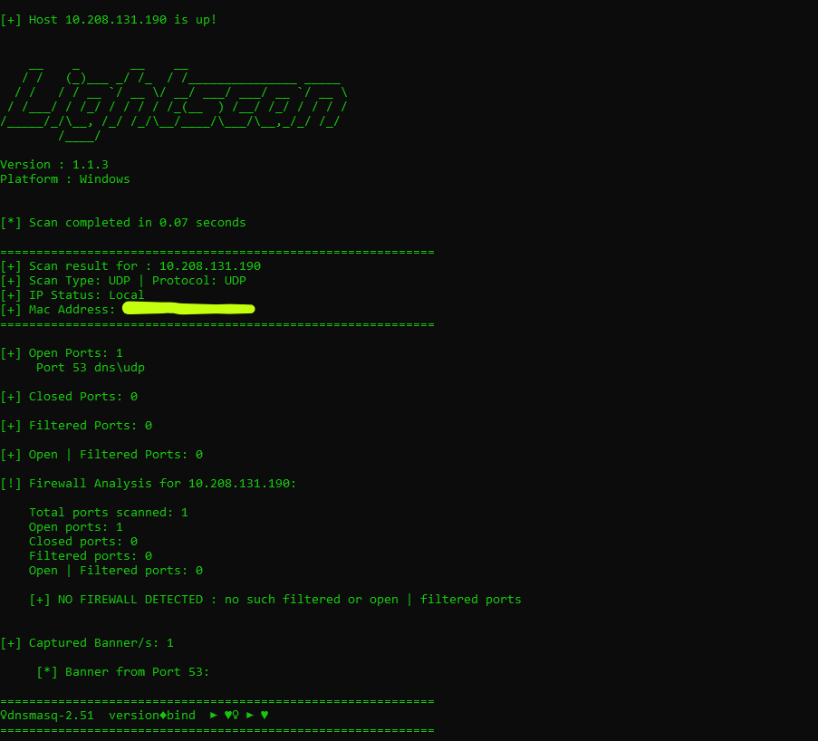

# Lightscan - Advanced Port Scanner

Lightscan is a powerful, multi-threaded port scanner built with Python and Scapy, designed for both security professionals and network administrators. It combines speed, accuracy all those features in a single tool.

# Features

## High-Performance Scanning

    Multi-threaded architecture for fast scans

    Multiple scan types: TCP Connect, SYN Stealth, UDP

    Configurable speed presets from Paranoid to Light-mode (400 threads)

    Smart host discovery with threaded ICMP/TCP detection

## Network Range Support

    CIDR notation (/8, /16, /24, etc.) for subnet scanning

    Multiple target support via comma-separated lists

    Intelligent host filtering - skips non-responsive hosts in network scans

    Safety warnings for large network ranges

## Advanced Detection

    Service detection with custom and system service databases

    Firewall detection with detailed analysis

    Port state classification: Open, Closed, Filtered, Open|Filtered

    Retry mechanism for unreliable networks

## Professional Features

    Flexible port specification: ranges, lists, and top ports

    Verbose output for debugging and analysis

    Customizable timeouts and thread counts

    Clean, organized output with per-target results
    

# Installation

      git clone https://github.com/adamboulaaz92-jpg/Light-Scan.git
  
      cd Light-Scan
      
      pip install -r requirements.txt
      
# Importante

      before running Light-Scan you need to install Npcap from https://npcap.com/#download (it's required for Light-Scan to run)
    
# User Guide : 

## Basic Scanning
  
  ### Single Target TCP Scan
  
      python Lightscan.py -T 192.168.1.1
  
  ### SYN Stealth Scan
  
      python Lightscan.py -T 192.168.1.1 -st SYN
  
  ### UDP Scan on Specific Port
  
      python Lightscan.py -T 192.168.1.1 -st UDP -p 53
  
## Network Scanning
  
  ### Scan Entire Subnet
  
      python Lightscan.py -T 192.168.1.0/24 -F
  
  ### Multiple Targets
  
      python Lightscan.py -T 192.168.1.1,192.168.1.50,10.0.0.0/24
  
  ### Fast Network Scan with Top Ports
  
      python Lightscan.py -T 10.0.0.0/16 -F -s fast
  
## Advanced Usage
  
  ### Custom Port Range with Retries
  
      python Lightscan.py -T target.com -p 1-1000 --max_retries 3
  
  ### High-Speed Scan with Custom Threads
  
      python Lightscan.py -T 192.168.1.1 -t 200 -tm 0.5
  
  ### Verbose Output for Debugging
  
      python Lightscan.py -T 192.168.1.1 -v -st SYN
  
## Command Line Options
  
      Required:
        -T, --target        Target IP, hostname, or CIDR notation
      
      Optional:
        -p, --port          Port(s) to scan (e.g., 80, 1-1000, 22,80,443)
        -s, --speed         Scan speed preset [paranoid|slow|normal|fast|insane|Light-mode]
        -st, --scan_type    Scan type [TCP|SYN|UDP] (default: TCP)
        -F                  Scan top 100 ports (fast mode)
        -mx, --max_retries  Max retries for unresponsive ports (default: 1)
        -t, --threads       Number of threads to use
        -tm, --timeout      Socket timeout in seconds
        -v, --verbose       Show verbose output
  
  ## Speed Presets
  
      paranoid: 1 thread, 3s timeout
  
      slow: 6 threads, 2s timeout
  
      normal: 30 threads, 1.5s timeout
  
      fast: 60 threads, 1.5s timeout
  
      insane: 160 threads, 1s timeout
  
      Light-mode: 400 threads, 1s timeout
  
## Port Specification Examples
  
  ### Single Port
  
      -p 80
  
  ### Port Range
      
      -p 1-1000
  
  ### Multiple Ports
  
      -p 22,80,443,8080
  
  ### Mixed Ranges and Single Ports
  
      -p 20-25,80,443,8000-9000
  
## Scan Types
  
  ### TCP Connect Scan (-st TCP)
  
      Uses full TCP three-way handshake
  
      Most reliable but easily detectable
  
      Works on all systems without special privileges
  
  ### SYN Stealth Scan (-st SYN)
  
      Half-open scanning technique
  
      Stealthier than TCP connect
  
      Requires root/administrator privileges
  
      Sends RST packet to close connection
  
  ### UDP Scan (-st UDP)
  
      Connectionless protocol scanning
  
      Slower than TCP scans due to timeouts
  
      Useful for DNS, DHCP, SNMP services
  
## Network Scanning Features
  CIDR Notation Support
  
  Lightscan supports standard CIDR notation for scanning entire networks:
  
  ### Class C subnet (256 hosts)
      python lightscan.py -T 192.168.1.0/24
  
  ### Class B subnet (65,536 hosts) - with safety warning
      python lightscan.py -T 10.0.0.0/16
  
  ### Class A subnet (16.7 million hosts) - extreme warning
      python lightscan.py -T 10.0.0.0/8
  
## Smart Host Discovery
  
  ### When scanning multiple targets:
  
      Performs threaded host discovery first
  
      Only scans hosts that respond to discovery probes
  
      Shows summary of responsive vs non-responsive hosts
  
      Saves time by skipping dead hosts
  
  ### Safety Features
  
      Warnings for large network scans
  
      Confirmation prompts for massive scans
  
      Progress indicators for large expansions
  
## Output Interpretation

  ### Port States
  
      Open: Service is listening and accessible
  
      Closed: Host is up but no service listening
  
      Filtered: Firewall blocking access (no response)
  
      Open|Filtered: Unable to determine (common with UDP)
  
## Firewall Detection
  
  ### Lightscan analyzes response patterns to detect firewalls:
  
      No Firewall: Most ports are closed or open
  
      Firewall Detected: Significant port filtering
  
      Strong Firewall: Most ports are filtered
  
      Inconclusive: Mixed response patterns
  
  ### Performance Tips
  
      Use -F for large networks: Scan top 100 ports instead of top 1000
  
      Adjust timeout: Reduce timeout for internal networks (-tm 0.5)
  
      Increase threads: Use more threads for faster scanning (-t 100)
  
      Reduce retries: Use --max_retries 1 for reliable networks
  
      Choose appropriate scan type: SYN for speed, TCP for reliability
  
# Troubleshooting
  
  ## Scan is too slow
  
      Reduce timeout: -tm 1.0
  
      Increase threads: -t 100
  
      Use faster speed preset: -s fast
  
  ## No results from UDP scan
  
      UDP is connectionless - timeouts are normal
  
      Increase retries: --max_retries 3
  
      Check if service is actually running
  
  ## SYN scan not working
  
      Ensure you have root/administrator privileges
  
      Try TCP connect scan instead: -st TCP
  
  ## Host discovery missing hosts
  
      Some hosts block ICMP
  
      Use TCP-based discovery (automatic fallback)
  
      Check firewall rules on target hosts
  
  ## Use Cases
  
      Penetration Testing: Network reconnaissance and service enumeration
  
      Network Administration: Inventory and monitoring of network services
  
      Security Auditing: Identifying unauthorized services and open ports
  
      Educational Purposes: Learning about network protocols and scanning techniques
  
# Legal Disclaimer
  
  ## This tool is intended for:
  
      Security professionals conducting authorized assessments
  
      Network administrators monitoring their own networks
  
      Educational and research purposes
  
  Always ensure you have proper authorization before scanning any network or system. Unauthorized scanning may be illegal in your jurisdiction.
  Contributing
  
  Contributions are welcome! Please feel free to submit pull requests, report bugs, or suggest new features.
  License
  
  This project is licensed under the GNU GENERAL PUBLIC LICENSE - see the LICENSE file for details.
