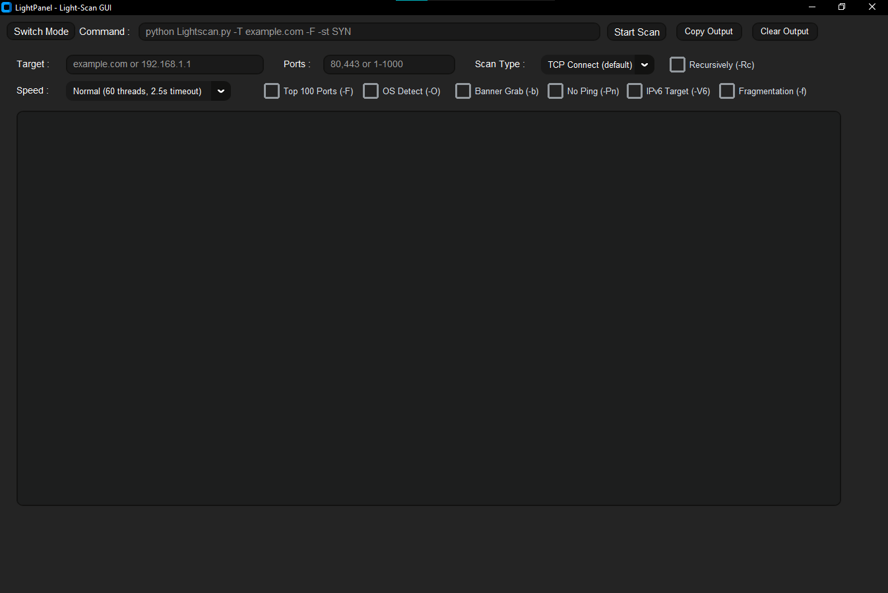

# Lightscan - Advanced Port Scanner

LightScan is a powerful, multi-threaded port scanner built with Python and Scapy, designed for security professionals and network administrators who demand both speed and accuracy.

Unlike traditional scanners that sacrifice one for the other, LightScan combines enterprise-grade features into a single, cohesive tool — delivering fast results without compromising depth.

# Light-Scan Version 1.1.6 (Current Version)

# Features

## High-Performance Scanning

Multi-threaded architecture for fast scans
Multiple scan types: TCP Connect, SYN Stealth, UDP, NULL, FIN, ACK, WINDOW, MAIMON, FDD, XMAS, FTP-BOUNCE,IPPROTO

Configurable speed presets from Paranoid to Light-mode (500 threads)

Smart host discovery with threaded ICMP/ICMPv6/TCP/IP/ARP/NDP detection

## Network Range Support

CIDR notation (/8, /16, /24, etc.) for subnet scanning

Multiple target support via comma-separated lists

Intelligent host filtering - skips non-responsive hosts in network scans

Safety warnings for large network ranges

## Advanced Detection

Service detection with custom and system service databases

Firewall detection with detailed analysis

Port state classification: Open, Closed, Filtered, Unfiltered, Open|Filtered, Defended, Undefended

Retry mechanism for unreliable networks

## Professional Features

Flexible port specification: ranges, lists, and top ports

Verbose output for debugging and analysis

Customizable timeouts and thread counts

Clean, organized output with per-target results
    
# Installation

      git clone https://github.com/adamboulaaz92-jpg/Light-Scan.git
      
# Importante

## For Windows
before running Light-Scan you need to install Npcap from https://npcap.com/#download (it's required for Light-Scan to run)

## Windows Setup

    cd Light-Scan
    
    python -m venv venv

    .\venv\Scripts\activate

    pip install -r requirements.txt
    
## For Linux
before running Light-Scan you need to install Npcap from https://npcap.com/#download (it's required for Light-Scan to run) or you can just install libpcap by the command :

### For Debian Based Linux :
        sudo apt install libpcap-dev
### For Arch Based Linux :
        sudo pacman -S libpcap
### For RHEL/CentOS/Fedora :
        sudo yum install libpcap-devel
        # or for newer Fedora:
        sudo dnf install libpcap-devel
### For SUSE :
        sudo zypper install libpcap-devel
### For Alpine Linux :
        sudo apk add libpcap-dev

## Linux Setup

### For Debian Based Linux :

    sudo apt install python3-venv

    python3 -m venv venv

    source venv/bin/activate

    pip install -r requirements.txt
    
### For Arch Based Linux :

    python -m venv venv

    source venv/bin/activate

    pip install -r requirements.txt

### For RHEL/CentOS/Fedora :

    sudo yum install python3-venv
    # or for newer Fedora:
    sudo dnf install python3-venv

    python3 -m venv venv

    source venv/bin/activate

    pip install -r requirements.txt

### For SUSE :

    sudo zypper install python3-venv

    python3 -m venv venv

    source venv/bin/activate

    pip install -r requirements.txt

### For Alpine Linux :

    sudo apk add python3 py3-pip

    python3 -m venv venv

    source venv/bin/activate

    pip install -r requirements.txt

## For macOS

Before running Light-Scan, you need to install libpcap:

### Using Homebrew (Recommended):

    /bin/bash -c "$(curl -fsSL https://raw.githubusercontent.com/Homebrew/install/HEAD/install.sh)"
    brew install libpcap

### Using MacPorts:

    sudo port install libpcap

## macOS Setup

    python3 -m venv venv

    source venv/bin/activate

    pip install -r requirements.txt

## For FreeBSD / OpenBSD / NetBSD

Before running Light-Scan, install libpcap:

### FreeBSD:

    sudo pkg install libpcap python3

### OpenBSD:

    sudo pkg_add libpcap python3

### NetBSD:

    sudo pkgin install libpcap python3

## BSD Setup

    python3 -m venv venv

    source venv/bin/activate

    pip install -r requirements.txt

## For Solaris / Illumos

### Solaris 11:

    pkg install libpcap

### Illumos (OpenIndiana, etc.):

    sudo pkg install libpcap

## Solaris Setup

    python3 -m venv venv

    source venv/bin/activate

    pip install -r requirements.txt

## Guided Auto Setup

    python setup.py
  
# User Guide : 

## Basic Scanning
  
  ### Single Target TCP Scan
  
      python Lightscan.py -T 192.168.1.1
  
  ### SYN Stealth Scan
  
      python Lightscan.py -T 192.168.1.1 -st SYN
  
  ### UDP Scan on Specific Port
  
      python Lightscan.py -T 192.168.1.1 -st UDP -p 53
  
## Network Scanning
  
  ### Scan Entire Subnet
  
      python Lightscan.py -T 192.168.1.0/24 -F
  
  ### Multiple Targets
  
      python Lightscan.py -T 192.168.1.1,192.168.1.50,10.0.0.0/24
  
  ### Fast Network Scan with Top Ports
  
      python Lightscan.py -T 10.0.0.0/16 -F -s fast
  
## Advanced Usage
  
  ### Custom Port Range with Retries
  
      python Lightscan.py -T target.com -p 1-1000 --max-retries 3
  
  ### High-Speed Scan with Custom Threads
  
      python Lightscan.py -T 192.168.1.1 -t 200 -tm 0.5
  
  ### Verbose Output for Debugging
  
      python Lightscan.py -T 192.168.1.1 -v -st SYN
  
## Command Line Options
  
    usage: Lightscan.py [-h] [-T TARGET] [-V6] [-p PORT] [-pp PING_PORT]
                        [-s {paranoid,slow,normal,fast,insane,Light-mode}] [-v] [-st SCAN_TYPE] [--ftp-bounce FTP_SERVER]
                        [-F] [-mx MAX_RETRIES] [-t THREADS] [-lst] [--lsse-lst] [-tm TIMEOUT] [-Rc] [-f] [-Pn] [-b] [-O]
                        [-mac] [-Pan] [-Pi] [-Pip PIP] [-A] [-Pt] [-Ps] [-Pk] [-Pu] [-PIt] [-PA] [-Pin] [-q]
                        [--script SCRIPT] [--domain DOMAIN] [--dns-server DNS_SERVER] [-W WORDLIST]
                        [--extensions EXTENSIONS] [--status-codes STATUS_CODES] [--redirect] [--url URL] [--mxp MXP]
                        [--mxd MXD] [-sp SP] [--lsse]
    
    Light-Scan Port Scanner
    
    options:
      -h, --help            show this help message and exit
      -T, --target TARGET   Target IP or Hostname
      -V6                   used when the target is an IPv6
      -p, --port PORT       Port/s to scan
      -pp, --ping-port PING_PORT
                            Port/s to Ping on it
      -s, --speed {paranoid,slow,normal,fast,insane,Light-mode}
                            Scan speed preset
      -v, --verbose         Show verbose output
      -st, --scan-type SCAN_TYPE
                            Scan types {TCP,SYN,UDP,NULL,FIN,ACK,XMAS,WINDOW,MAIMON,FDD,FTP-BOUNCE,IPPROTO}
      --ftp-bounce FTP_SERVER
                            FTP server for bounce scan (e.g., 192.168.1.100)
      -F                    Scan The Top 100 ports for fast scanning
      -mx, --max-retries MAX_RETRIES
                            Max number of retries if port show a no response
      -t, --threads THREADS
                            Number of threads to use
      -lst                  List all targets
      --lsse-lst            List all LSSE Scripts
      -tm, --timeout TIMEOUT
                            Timeout with second
      -Rc, --recursively    recursively scan host that shown to be down or not responding and disable flags like
                            -v,-Pn,etc ...
      -f, --fragmente       fragment the sending packet for more stealth
      -Pn, --no-ping        Do not ping the target/s
      -b, --banner          Banner Grabing
      -O, --os              OS Fingerprint
      -mac                  Light-Scan will not be capabelle of getting target mac on Local Networks
      -Pan, --local-ping    Performe an ARP Ping on Local Networks by default or NDP Ping on Local Networks for IPv6 mode
      -Pi, --ip-ping        IP Protocol Ping
      -Pip PIP              For Specefiy The IP Protocols that -Pi is going to use rather then default
      -A, --agressive       Agressive scan activate all of OS Fingerprints, Banner Grabing, Insane Speed , SYN Scan and
                            Scan Top 100 Ports
      -Pt, --tcp-ping       Do a TCP Ping
      -Ps, --syn-ping       Do a Syn Ping
      -Pk, --ack-ping       DO a ACK Ping
      -Pu, --udp-ping       Do a UDP Ping
      -PIt, --icmp-timestamp-ping
                            Do scan a ICMP Timestamp Ping
      -PA, --icmp-address-ping
                            Do scan a ICMP Address Ping
      -Pin, --icmp-information-ping
                            Do scan a ICMP Information Ping
      -q, --quiet           Quiet mode {does't print the Tool Banner}
      --script SCRIPT       LSSE Script ,Ex: --script http-cert
      --domain DOMAIN       Domain for http/https and Dns based scripts
      --dns-server DNS_SERVER
                            dns server that Light-Scan is going to use (Is Set by Default
      -W, --wordlist WORDLIST
                            Wordlist for scripts
      --extensions EXTENSIONS
                            Extensions for web based scripts
      --status-codes STATUS_CODES
                            Status Codes for web based scripts
      --redirect            Redirect http/https requests for http scripts
      --url URL             Victime URL
      --mxp MXP             max pages to get
      --mxd MXD             max depth to crawl
      -sp SP                Port/s that are going to use by scripts
      --lsse                Use that flag when you want just to performe a script
  
##  Speed Presets

LightScan offers **six speed presets** to balance performance against network conditions and stealth requirements. Each preset controls two key parameters:

- **Threads** — Number of concurrent scan threads (higher = faster)
- **Timeout** — Seconds to wait for a response (higher = more reliable)

| Preset | Threads | Timeout | Best For |
|--------|---------|---------|----------|
|  **paranoid** | 2 | 4.0s | Stealth scans, IDS/IPS evasion, unstable networks |
|  **slow** | 30 | 3.0s | Noisy environments, careful reconnaissance |
|  **normal** | 60 | 2.5s | **Default** — balanced for most scenarios |
|  **fast** | 120 | 2.5s | Internal networks, trusted environments |
|  **insane** | 240 | 1.25s | High-speed LAN scans, aggressive timing |
|  **Light-mode** | 500 | 1.25s | Maximum speed — use on reliable, low-latency networks |

  
## Port Specification Examples
  
  ### Single Port
  
      -p 80
  
  ### Port Range
      
      -p 1-1000
  
  ### Multiple Ports
  
      -p 22,80,443,8080
  
  ### Mixed Ranges and Single Ports
  
      -p 20-25,80,443,8000-9000
    
## Network Scanning Features
  CIDR Notation Support
  
  Lightscan supports standard CIDR notation for scanning entire networks:
  
  ### Class C subnet (256 hosts)
      python Lightscan.py -T 192.168.1.0/24
  
  ### Class B subnet (65,536 hosts) - with safety warning
      python Lightscan.py -T 10.0.0.0/16
  
  ### Class A subnet (16.7 million hosts) - extreme warning
      python Lightscan.py -T 10.0.0.0/8
  
## Smart Host Discovery
  
  ### When scanning multiple targets:
  
Performs threaded host discovery first
  
Only scans hosts that respond to discovery probes

Saves time by skipping dead hosts
  
  ### Safety Features
  
Warnings for large network scans
  
Confirmation prompts for massive scans
  
Progress indicators for large expansions
  
### Port States

LightScan classifies ports into **seven distinct states** based on response analysis:

| State | Meaning | Common Causes |
|-------|---------|----------------|
| **Open** | Service is actively listening and accessible | Web server, SSH, database, etc. |
| **Closed** | Host is up but no service is listening | Unused port, service not running |
| **Filtered** | Firewall or filter is blocking access | Stateful firewall, ACL, DROP rules |
| **Open\|Filtered** | Unable to determine (no response received) | Common with UDP scans, packet loss |
| **Defended** | Firewall detected (FDD scan result) | Port behind active firewall protection |
| **Undefended** | No firewall detected (FDD scan result) | Direct port access, no filtering |
| **Unfiltered** | Port accessible but not open (ACK scan) | Used in firewall rule mapping |
  
## Performance Tips
  
Use -F for large networks: Scan top 100 ports instead of top 1000
  
Adjust timeout: Reduce timeout for internal networks (-tm 1.5)
  
Increase threads: Use more threads for faster scanning (-t 100)
  
Reduce retries: Use --max-retries 1 for reliable networks
  
Choose appropriate scan type: SYN for speed, TCP for reliability
  
# Troubleshooting
  
  ## Scan is too slow
  
Reduce timeout: -tm 1.0
  
Increase threads: -t 150
  
Use faster speed preset: -s fast
  
  ## No results from UDP scan
  
UDP is connectionless - timeouts are normal
  
Increase retries: --max-retries 3
  
Check if service is actually running
  
  ## Host discovery missing hosts
  
Some hosts block ICMP
  
Use TCP-based discovery by using -Pt Flag
  
Check firewall rules on target hosts
  
# Legal Disclaimer
  
  ## This tool is intended for:
  
Security professionals conducting authorized assessments
  
Network administrators monitoring their own networks
  
Educational and research purposes
  
  Always ensure you have proper authorization before scanning any network or system. Unauthorized scanning may be illegal in your jurisdiction.
  Contributing
  
  Contributions are welcome! Please feel free to submit pull requests, report bugs, or suggest new features.

# Light-Scan 1.1.6 :

## Fixing Multiple bugs

## Extend Lightscan Services Data-Base

## Add a new scaning technique IP-PROTO Scan

## Upgrading LSSE with a new plugin "script" 

        __    _       __    __
       / /   (_)___ _/ /_  / /_______________ _____
      / /   / / __ `/ __ \/ __/ ___/ ___/ __ `/ __ \
     / /___/ / /_/ / / / / /_(__  ) /__/ /_/ / / / /
    /_____/_/\__, /_/ /_/\__/____/\___/\__,_/_/ /_/
            /____/
    
    Version : 1.1.6
    Platform : Windows
    
    
    [+] LSSE Response for http://scanme.nmap.org:
    
    [LSSE] Html Script Detection Script
    
    [+] Script/s Detected
    [+] Final Url: http://scanme.nmap.org/
    [+] NUmber of Scripts 2
    
    [#1] 
    
    [#2] 
    
    
    [+] LSSE run successfully

## Adding a dedicated packet sniffer LighSniff

    usage: LightSniff.py [-h] [-i INTERFACE] [-f FILTER] [-c COUNT] [-w WRITE] [-v] [--no-promisc] [-q] [--eth] [--vlan]
                         [--arp] [--mac MAC]
    
    LightSniff - Light-Scan Packet Capture Tool
    
    options:
      -h, --help            show this help message and exit
      -i, --interface INTERFACE
                            Network interface (e.g., eth0, Wi-Fi, wlan0)
      -f, --filter FILTER   BPF filter (e.g., 'tcp port 80', 'icmp', 'arp')
      -c, --count COUNT     Number of packets to capture (0 = infinite)
      -w, --write WRITE     Save to PCAP file
      -v, --verbose         Show detailed packet info
      --no-promisc          Disable promiscuous mode
      -q, --quiet           Quiet mode (no banner)
      --eth                 Show Ethernet frame info (MAC addresses, frame type)
      --vlan                Show VLAN tags (802.1Q)
      --arp                 Show only ARP packets
      --mac MAC             Filter by source or destination MAC address (e.g., aa:bb:cc:dd:ee:ff)
    
    Examples: LightSniff -i eth0 | LightSniff -i eth0 -f 'tcp port 80' -w http.pcap | LightSniff -i Wi-Fi -c 100 -v

## Lightscan GUI (LightPanel.py)

    python LightPanel.py

## Add a help menu for LSSE 

    (.venv) PS C:\Users\Octet Info\Documents\My Project\Light-Scan> python Lightscan.py --lsse-lst
        __    _       __    __                      
       / /   (_)___ _/ /_  / /_______________ _____ 
      / /   / / __ `/ __ \/ __/ ___/ ___/ __ `/ __ \
     / /___/ / /_/ / / / / /_(__  ) /__/ /_/ / / / /
    /_____/_/\__, /_/ /_/\__/____/\___/\__,_/_/ /_/ 
            /____/                                  
    
    Version : 1.1.6
    Platform : Windows 
    
    
    [+] LSSE Scripts (LightScan Scripting Engine)
    --------------------------------------------------
    
    [1] spider
        Required:   --url
        Optional:   --mxd, --mxp
        Category:   safe/discovery/http_https
        Description: Recursively crawls websites for links, forms, and resources
    
    [2] http-robots
        Required:   --domain, -sp
        Optional:   None
        Category:   safe/discovery/http_https
        Description: Fetches and parses robots.txt for hidden paths
    
    [3] http-cert
        Required:   --domain, -sp
        Optional:   None
        Category:   safe/analysis/https
        Description: Grabs SSL/TLS certificate information
    
    [4] script
        Required:   --url
        Optional:   None
        Category:   safe/discovery/http_https
        Description: Detects Script tags in HTML pages
    
    [5] http-title
        Required:   --domain, -sp
        Optional:   --redirect
        Category:   safe/discovery/http_https
        Description: Extracts webpage titles
    
    [6] http-dir
        Required:   --url
        Optional:   --wordlist, --status-codes, --extensions
        Category:   medium/discovery/http_https
        Description: Brute forces directories and files
    
    [7] dns-subdomain-fuzzing
        Required:   --domain
        Optional:   --wordlist, --dns-server
        Category:   medium/discovery/dns
        Description: Brute forces subdomains using wordlist
    
    --------------------------------------------------
    [+] Usage: Lightscan --lsse --script <name>

## Full IPv6 support with new NDP and ICMPv6 Host Discovery

## Extend LightSave with 5 new saving formats

    usage: LightSave.py [-h] -C C [-S {txt,light,html,xml,csv,json}]
    
    LightSave : Light-Scan Scans Saving Tool
    
    options:
      -h, --help            show this help message and exit
      -C C                  Lightscan command
      -S {txt,light,html,xml,csv,json}
                            Saving Format (txt,light,html,xml,csv,json)
      
### Exemple of LightSave
    python LightSave.py -C "python Lightscan.py -T 127.0.0.1 -F -st UDP" -S xml
by that LightSave save your scan result ,it's obligatory to write the scan command inside ""
to make sure it going to run well

##  FDD Scan — Firewall Detection (Proprietary)

**FDD (Firewall Detection Scan)** is a proprietary scanning technique developed exclusively for LightScan. It sends a TCP packet with the **URGENT (URG) flag** to determine whether a firewall is protecting the target port.
The URG flag is rarely used in legitimate traffic, making it an excellent probe for firewall detection. By analyzing the response (or lack thereof), LightScan can determine if a firewall is actively filtering the port.

###  Response Interpretation

| Response Type | Classification | Explanation |
|---------------|----------------|-------------|
| `RST` or `RST-ACK` |  **Undefended Port** | The port responded directly — no firewall interference |
| `No Response` |  **Defended Port** | No response suggests a firewall is blocking the probe |
| `ICMP Type 3, Code 1,2,3,9,10,13` |  **Defended Port** | ICMP error indicates a firewall is actively rejecting the packet |

###  Example Usage

# Run FDD scan on a single port
    python Lightscan.py -T 192.168.1.1 -p 443 -st FDD

# Scan multiple ports with FDD
    python Lightscan.py -T 192.168.1.1 -p 22,80,443,8080 -st FDD

# Combined with verbose output
    python Lightscan.py -T 192.168.1.1 -p 1-1000 -st FDD -v

## 🙏 Acknowledgments

### Light-Scan is built on the shoulders of giants. We thank the open‑source community, especially to:

-  Scapy — The packet manipulation library that powers Light-Scan

-  Python — The language that makes it all possible

-  Nmap — For setting the standard in network scanning

-  The entire cybersecurity community — For pushing the boundaries of what's possible

        
